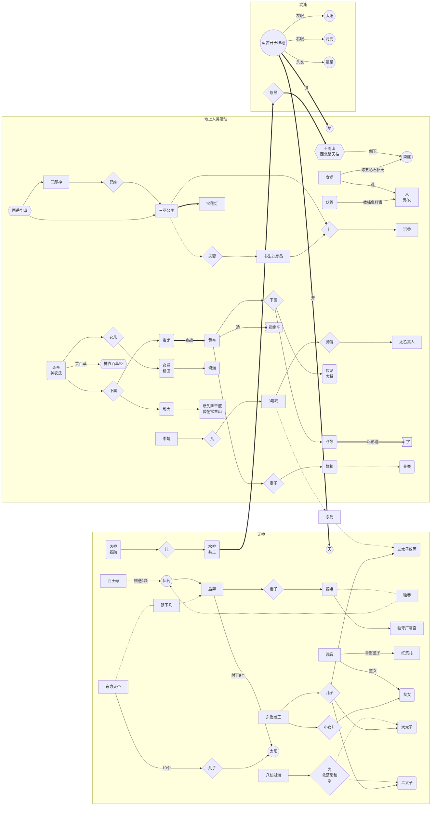

# 中国神话

```mermaid
graph LR

    0==开==>Sky
    0==辟==>Earth
    H2==>D0==>M1
    l3-.->杀死-.->P4

    subgraph 地上人类活动
        Earth((地))

        M1{{不周山<br>西北擎天柱}}--倒下-->H((窟窿))
        A[女娲]--造-->B[人<br>男/女]

        A--炼五彩石补天-->H

        M3{{西岳华山}}-->L1[二郎神]-->R8{兄妹}-->L2
        M3-->L2(三圣公主)-.->R9{夫妻}-.->l1[书生刘彦昌]
        L2==>宝莲灯
        L2-->R0{儿}-->L3[沉香]
        l1-->R0

        l2[李靖]-->R13{儿}
        R13-->l3[3哪吒]-->R14{师傅}-->L4[太乙真人]
        
        
        F1(伏羲)--教捕鱼打猎-->B

        F2(黄帝)-->R2{下属}-->F21(应龙<br>大将)
        R2{下属}-->F22(仓颉)
        F22(仓颉)==以形造==>D2>字]
        F2--造-->F23>指南车]
        F2-->R4{妻子}-->F4(嫘祖)-.->C1(养蚕)
        F3-->R5{女儿}-->F5(女娃<br>精卫)-->C2(填海)
        F3-->R3{下属}-->F31(蚩尤)

        F31==宣战==>F2

        R3{下属}-->F32(刑天)-.->M2(断头舞干戚<br>葬在常羊山)
        F3(炎帝<br>神农氏)--尝百草-->D1{{神农百草经}}
    end

    subgraph 混沌
        0((盘古开天辟地))
        0--左眼-->1((太阳))
        0--右眼-->2((月亮))
        0--头发-->3((星星))

        D0{怒触}
    end

    subgraph 天神
       
        H1(火神<br>祝融)-->R1{儿}-->H2(水神<br>共工)
        H6[西王母]--赠送1颗-->C4((仙药))-->H3
        H3[后羿]-->R6{妻子}-->H4(嫦娥)-.-独吞-.->C4
        H4-->独守广寒宫

        P1[观音]--善财童子-->红孩儿
        P1--童女-->P2(龙女)

        R16-.->P5
        P8[八仙过海]-->R16{为<br>救蓝采和<br>杀}
        R16-.->P6

        R11-->P5(大太子)
        R11-->P6(二太子)
        P3[东海龙王]-->R11{儿子}-->P4(三太子敖丙)
        P3[东海龙王]-->R12{小女儿}-->P2

        H3--射下9个-->C3((太阳))
        H5[东方天帝]--10个-->R7{儿子}-->C3
        H5-.-贬下凡-.->H3

        Sky((天))
    end

    

```

