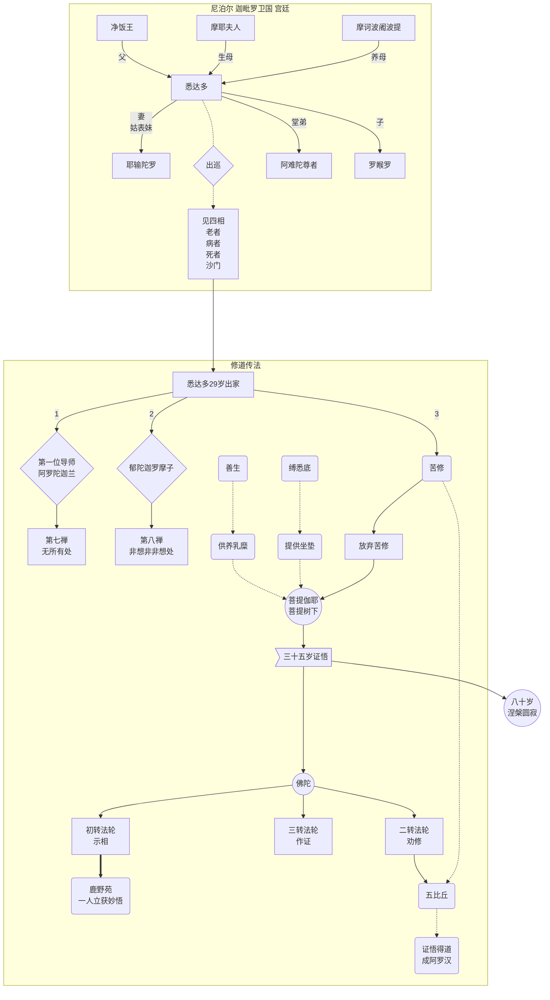
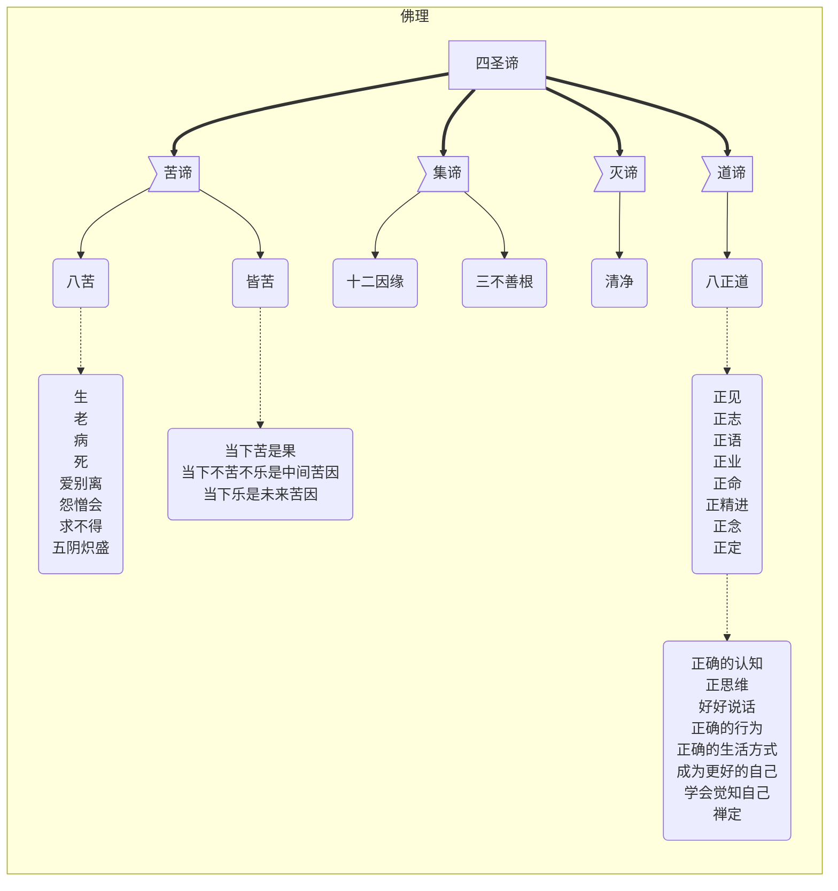
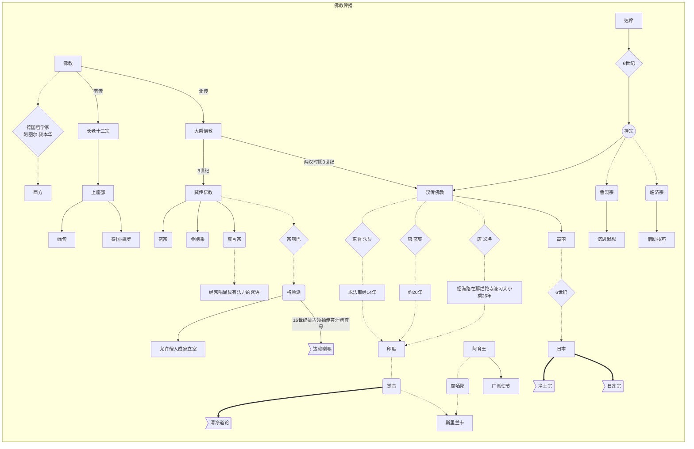
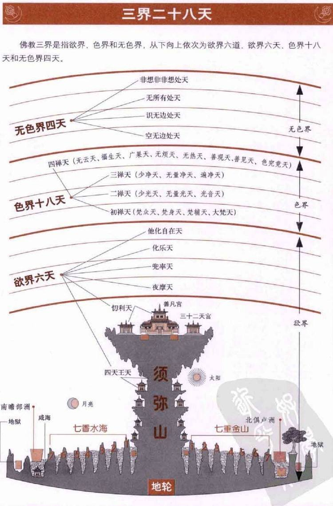

# 佛

觉察之道，每个人需要找到适合自己的法门

菩提、佛陀 都是同一根源，都是【醒觉】的意思

```tip
乔达摩·悉达多(释迦族), 与 孔子、苏格拉底 同时代，没有创立宗教。

成道后被尊称为释迦牟尼，意为“释迦族的圣人”,称号有 觉者、世尊、释尊、天尊、佛陀、佛祖

苦行非道，无神(所有的宗教就是一个信字，信仰是不问理由的)，一切自有因缘

感受每一次呼吸，每一口食物，每一步行走，自己体证道法
```

学佛法要提问题，要怀疑的，要求证的。

如果听了就相信，那是宗教，不是佛法。

佛法是科学的，要追问的，追问这个问题的究竟，并且要亲自试验求证。

## 名词解释

| 梵音 | 释义 | 组词造句 |
| ---- | ---- | ---- |
| 佛 | 醒 | 佛陀 —— 觉者、一个醒觉了的人|
| 乔达摩 | 族名,传自印度古代圣人|  |
| 悉达多 | 一切义成(达到自己目者)，成就大志者 |  |
| 释迦牟尼 | 释迦族的圣人 | C |
| 阿弥陀佛 | 无量寿佛 | 阿弥陀佛发愿：若得证悟<br>必帮助任何信奉他并且口念其名号的众生，<br>接引他们往生净土(极乐世界)。 |
| 南无 | 向...致敬 | 南无阿弥陀佛, 南无妙法莲华经 |
| 三藏 | 经藏，佛之说法 <br> 律藏，清规戒律的结集； <br> 论藏，稍后结集而成的佛学论著|  |
| 罗睺罗 | 覆障 |  |
| 阿罗汉 | 圣人 | 五百阿罗汉 |
| 精舍 | 寺庙 |  |
| 业 | 导致轮回的原因，决定去向 | 作业、善业、恶业 |
| 功德 | 功德只是善行的副产品 | 为了获得功德而行善其实只是自私的行为，并不能因此获取功德 |
| 大乘 | 大车、大众<br>自视为解苦脱难的一般方法 | 大乘佛教着重强调了救赎他人 |
| 菩提萨埵 | 献身大乘(菩萨乘)佛教者 | 简称 菩萨 |
| 三摩地 | 禅定 | 禅定确实是佛家的主要方法 |
| 奢摩他 | 止寂 |  |
| 般若 | 明慧之心 |  |
| 法 | 自然法 | 佛陀发现了“法”而不是创造了“法” |
| 达赖 | 蒙古语 智如大海 | 达赖喇嘛 |
| 缘起 | 有果必有因、轮回 |  |
| 勘 | 实地查看、核对 | 勘破红尘 |


## 术语

* 三宝：佛、法、僧
* 三法印：诸行无常、诸受皆苦、诸法无我
* 三不善根(三毒)：贪(雄鸡)、瞋(豕)、痴(口尾相衔的蛇)
* 四圣谛：苦(痛苦的存在)、集(痛苦的根源)、灭(痛苦的破灭)、道(导致痛苦破灭之道)
* 五戒：不杀生、不偷盗、不邪淫、不妄语、不饮酒 —— 为俗家弟子而设
* 六度(六波罗蜜)：布施、持戒、忍辱、精进、禅定、般若
* 六根（眼、耳、鼻、舌、身、意）
* 六尘（色、声、香、味、触、法）
* 八戒：

## 佛陀传



## 佛理



## 佛教传播


## 佛教简史

## 世界观

* 上下四方谓之宇：空间：【界】—— 3000个大千世界(无限)， 大千世界 = 1000个 中千世界(1000个 小千世界(1000个 太阳系))
* 往古来今谓之宙：时间：【世】—— 三世：现在、过去、未来
* 生命方式：胎生、卵生、湿生、化生
* 六道轮回：天道、阿修罗道、人道、畜生道、饿鬼道、地狱道



## 戒律

佛陀入灭前，阿难尊者问佛陀:“如来灭后，我等因以何为师？佛说：因以戒为师

* 第一、不杀生
* 第二、不偷盗
* 第三、不邪淫
* 第四、不妄语
* 第五、不饮酒

丛林清规 

* 律有二百二十七条规定，其中详细规定了僧众应该如何共同生活。 
* 数量众多的律条保证了修院内部的标准化和程序化,
* 如此则可将争议和意见不合减少到最低；
* 于是乎，僧伽制度便可以道德化的小社会示范于人。

## 法门

* 安那般那出入息：呼吸法 —— 一消一息就是佛学讲的一生一灭
* 《楞严经》中有二十五位菩萨圆通法门

## 四圣谛

苦谛：生苦、老苦、病苦、死苦、爱别离苦、怨憎会苦、求不得苦、五阴(蕴)炽盛苦。
集谛：一切三界(欲界、色界、无色界)烦恼及业，皆名“集谛”。
灭谛：欲求一旦清除，苦难必将终止，涅槃亦可获得。
道谛：八正道 —— **慧**(正见、正思)、**戒**(正语、正业、正命)、**定**(正勤、正念、正定)

## 六度(大乘)

* 一、布施（檀那）
* 二、持戒（尸罗）
* 三、忍辱（羼提）
* 四、精进（毗梨耶）
* 五、禅定（三摩地）
* 六、智慧（般若）


## 七支坐法

又简称它为跏趺坐，俗名盘足坐法。

```tip
静坐距离饭前饭后半个小时以上，环境须光线柔和、空气流通，但要避免避免风吹

静坐时微带笑容，神经自然会全部放松

循序渐进，短时多次，盘腿方式交替进行
```

* （一）双足跏趺（双盘足）。

    + 如果不能双盘，便用单盘。
    + 或把左足放在右足上面，叫做如意坐。
    + 或把右足放在左足上面，叫做金刚坐。
    + 开始习坐，单盘也不可能时，也可以把两腿交叉架住。

* （二）脊梁直竖。

    + 使背脊每个骨节，犹如算盘子的叠竖。
    + 但身体衰弱或有病的，初步不可太过拘泥直竖，更不可以过分用力。

* （三）左右两手圜结在丹田（小腹之下）下面，平放在胯骨部分。

    + 两手心向上，把右手背平放在左手心上面，两个大拇指轻轻相拄。
    + 这在佛家，便叫做“结手印”，这种手势，也叫做三昧印（就是定印的意思）。

* （四）左右两肩稍微张开，使其平整适度为止，不可以沉肩亸背。

* （五）头正，后脑稍微向后收放。

    + 前颚内收（不是低头），稍微压住颈部左右两条大动脉管的活动即可。

* （六）双目微张，似闭还开，好像半开半闭地视若无睹。

    + 目光随意确定在座前七八尺处，或一丈一二尺许。（如平常多用眼睛工作的人，在静坐之初，先行闭目为佳。）

* （七）舌头轻微舔抵上腭，犹如还未生长牙齿婴儿酣睡时的状态。

## 八禅境界

* 五：空无边处
* 六：识无边处
* 七：无所有处
* 八：非想非非想

## 大乘菩萨十地

“十地”是通往涅槃的主要路标。佛教修行的十个阶位。

## 印度教派

婆罗门三大神祇：大梵天、毗湿奴、湿婆

## 言论

佛教伦理的基础就是不害众生。

所有事物都具有如下三个特征或“印记”：有漏皆苦、诸行无常以及诸法无我

净土宗看来，阿弥陀佛的西方极乐世界也并不完全等同于涅槃。转生在净土之中的人仍然需要为最终获得证悟而不懈努力。

大乘佛教并不拒绝佛陀的早期教诫，只是有时候会以极端方式对其加以重新解释。

禅定完全没有副作用——这就跟吸毒完全不同了——更不会“走火入魔”，其好处却是日积月累和持久的。清醒的时候，意识不断地出入恍惚状态。

禅定的目的就是将精神上的“静电干扰”加以屏蔽，以减少精神上的“窃窃私语”，以免消耗掉心理的能量。


方便之法：大乘佛教积极地发展这一观念，在《妙法莲华经》中明确表示，早期教义不仅是技巧性的传达，而且是根本上的“方便智巧”。

## 蔡志忠《佛陀说》

### 佛教圣典

* 三法印：诸行无常，诸受皆苦，诸法无我


* 四圣谛
  > 苦谛：生老病死、怨憎会、爱离别、求不得
  > 集谛：十二因缘次第
  > 灭谛：无我境界，苦将无处附着
  > 道谛：八正道
* 缘起法(十二因缘次第)：

| 十二因缘法 | 注释 | 备注 |
| ---- | ---- | ---- |
| 无明 | 对生命的实相 不如实知 | 痛苦的原因 |
| 行 | 说 做 想 | 动 |
| 识 | 眼 耳 鼻 舌 身 意 | 认知 |
| 明色 | 情境(外) 情绪(内) | 观察 |
| 六入 | 所见 所听 所闻 所尝 所触 所想  | 识 得的信息 |
| 触 | 外尘 与 内心 相交会合 | 感触 |
| 受 | 乐受(际遇好) 苦受(际遇坏) 不苦不乐受(际遇好坏不明) | 感受 |
| 爱 | 贪(际遇好) 嗔(际遇坏) 痴(际遇好坏不明) | 反应 |
| 取 | 贪、嗔、痴 执取于内心深处 | 习惯 |
| 有 | 我 | 身心常处于自我中心的主观意识里 |
| 生 | 痛苦产生 |  |
| 老死 | 诸行无常，乐无常，苦也无常 | 苦会消失 |

* 八正道


### 佛陀说

```tip
我只说苦是如何产生的，苦应该如何终止！

凡是跟苦生苦灭无关的言论就不是我所说的。
```

#### 十大不可相信

* 不要因为口耳相传，就信以为真。
* 不要因为合乎于传统，就信以为真。
* 不要因为轰动一时流行广远，就信以为真。
* 不要因为出自于圣典，就信以为真。
* 不要因为合乎于逻辑，就信以为真。
* 不要因为根据哲理，就信以为真。
* 不要因为符合常识推理，就信以为真。
* 不要因为合乎于自己的见解，就信以为真。
* 不要因为演说者的威信，就信以为真。
* 不要因为他是你的导师，就信以为真。

### 佛语录