# 西游记



## 待整理

* 关键人物关系总图
* 每一集 人物关系图
* 故事时序图
* 100集信息统计表(考虑用数据库或excel存储)
> 集数,title,剧情摘要,时间,地点,主角,配角,主妖怪,副妖怪,主帮手,副帮手,因,果,隐喻

> 文化(佛教概念、道家概念、传统文化),关联-呼应(其他集的情节关联)

> 历史(历史依据),引用(参考了其他资料、故事),外联(其他故事的同名人、事)

> 81难

```mermaid
graph TB

    style 孙 fill:#333,fill-opacity:0.1,stroke:#faa,stroke-width:4px
    style 玉 fill:#666,fill-opacity:0.1,stroke:#faa,stroke-width:6px
    style 如 fill:#999,fill-opacity:0.1,stroke:#faa,stroke-width:6px

    太上老君-->猪悟能

    东海龙王-->如意金箍棒-->孙[孙悟空]
    观音菩萨-->紧箍咒-->孙
    观音菩萨-->弟子{弟子}-->木吒
    观音菩萨-->金箍咒-->黑熊怪

    菩提祖师-->72变-->孙

    牛魔王-->结拜兄弟-->孙
    红孩儿-->三昧真火-->孙


    孙-->大闹天宫-->玉皇大帝
    孙-->搅乱蟠桃会-->王母娘娘

    如意真仙-->兄弟-->牛魔王

    如[如来]-->制服{制服}-->孙悟空

    猪悟能-->调戏{调戏}-->嫦娥

subgraph 道教

    玉[玉皇大帝]-->东海龙王
    玉[玉皇大帝]-->太上老君
    玉[玉皇大帝]-->太白金星
    玉[玉皇大帝]-->托塔李天王
    玉[玉皇大帝]-->外甥{外甥}-->二郎神

        二郎神-->狗{宠物}-->哮天犬
        二郎神-->下属{下属}-->梅山六怪
        二郎神-->妹妹{妹妹}-->三圣母
        三圣母-->儿子{儿子}-->沉香


        沉香-->舅舅-->二郎神
    

    托塔李天王-->金吒
    托塔李天王-->木吒
    托塔李天王-->哪吒

    王母娘娘-->七仙女

    太上老君-->童子
        童子-->金角大王
        童子-->银角大王

    太上老君-->坐骑-->青牛精

    嫦娥
 end

subgraph 取经人

    唐僧-->脚力{脚力}-->小白龙
    唐僧-->徒弟{徒弟}
    徒弟-->孙
    徒弟-->猪悟能
    徒弟-->沙悟净

end

subgraph 佛教

    如[如来]-->阿难
    如[如来]-->迦叶
    如[如来]-->观音菩萨
    如[如来]-->五百罗汉

end


subgraph 散仙

    五庄观-->地仙之祖
    斜月三星洞-->菩提祖师
    灵山-->金顶大仙
 end

subgraph 妖魔

    女儿国-->蝎子精
    女儿国-->如意真仙

    火焰山-->牛魔王
    牛魔王-->子-->红孩儿
    牛魔王-->妻-->罗刹女
    牛魔王-->妾-->玉面狐狸

    黑熊怪

    蝎子精

    蜘蛛精
    蜈蚣精

end
```

