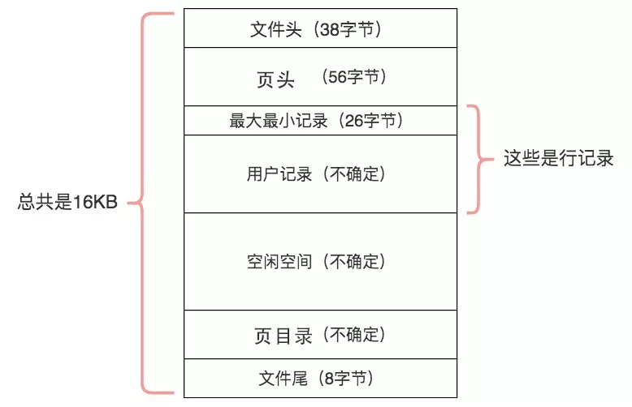
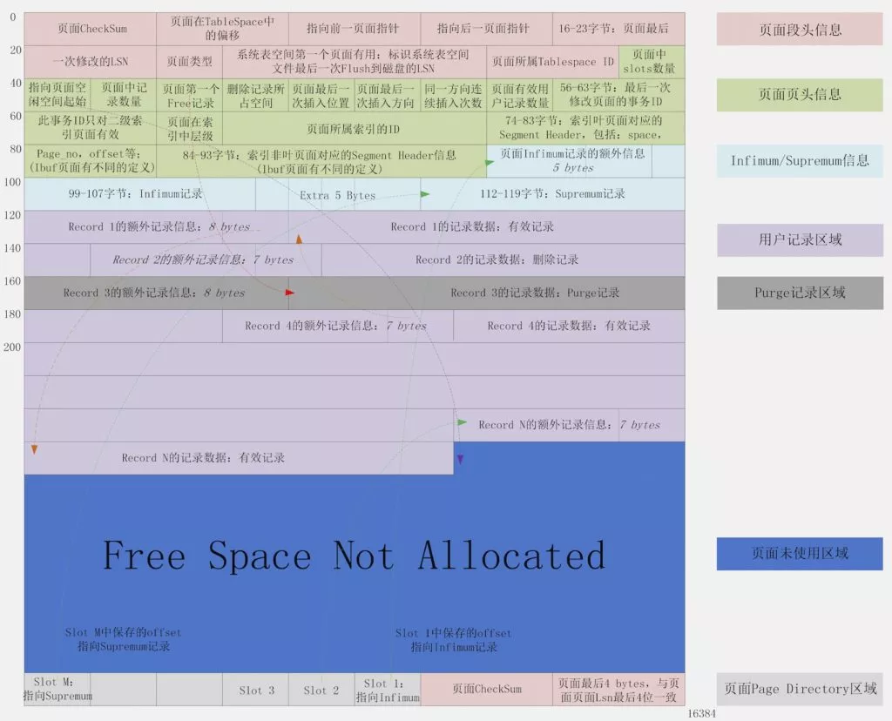

## 表

```tip
分表、分区【拆分策略】：按 查询主区分ID hash取模、范围分片；按 查询时段 年/月/周 拆分 区分冷热数据
```

## 范式

## 索引

| MySQL索引 | 主键索引 | 普通索引 |
| ---- | ---- | ---- |
| MyISAM <br> 非聚簇索引 |  |  |
| InnoDB <br> 主键-聚簇索引 <br> 辅助-非聚簇索引 |  |  |


```tip
InnoDB 主键索引B+Tree(聚簇索引 叶子节点是data + 指针)，辅助索引B+Tree(非聚簇索引，叶子节点是主键值)

MyISAM 主键索引索引B+Tree(非聚簇索引 叶子节点是主键值)，，辅助索引B+Tree(非聚簇索引，叶子节点是辅助键值)
```

索引的本质：
* 通过不断地缩⼩想要获取数据的范围来筛选出最终想要的结果(尽可能读取内存，避免读取磁盘)，
* 同时把随机读取变成顺序读取(较少I/O次数)。
* 二分法查找(平衡二叉树logN)比顺序查找(线性N)快得多

```danger
理解索引是如何工作的非常重要，应该根据这些理解来创建最合适的索引

而不是根据一些诸如 
    “在多列索引中将选择性最高的列放在第一列” 或 “应该为WHERE子句中出现的所有列创建索引”
之类的经验法则及推论

如何判定索引是否合理——按响应时间来对查询进行分析
```

### B-Tree 平衡多路查找树


* 每个节点最多有m个孩⼦，m称为b树的阶
* 除了根节点和叶⼦节点外，其它每个节点⾄少有Ceil(m/2)个孩⼦
* 若根节点不是叶⼦节点，则⾄少有2个孩⼦
* 所有叶⼦节点都在同⼀层，且不包含其它关键字信息
* 每个⾮终端节点包含n个关键字（健值）信息
* 关键字的个数n满⾜：ceil(m/2)-1 <= n <= m-1 
* ki(i=1,…n)为关键字，且关键字升序排序(默认ASC排序)
* Pi(i=1,…n)为指向⼦树根节点的指针。P(i-1)指向的⼦树的所有节点关键字均⼩于ki，但都⼤于k(i-1)

### B+Tree 平衡多路查找树


* 每个节点⾄多有m个⼦⼥
* 除根结点外,每个结点⾄少有[m/2]个⼦⼥，根结点⾄少有两个⼦⼥
* 有k个⼦⼥的结点必有k个关键字
* ⽗节点中持有访问⼦节点的指针
* ⽗节点的关键字在⼦节点中都存在（如上⾯的1/20/35在每层都存在），要么是最⼩值(升序)，要么是最⼤值(降序)
* 最底层的节点是叶⼦节点
* 除叶⼦节点之外，其他节点不保存数据，只保存关键字和指针
* 叶⼦节点包含了所有数据的关键字以及data，叶⼦节点之间⽤链表连接起来，可以⾮常⽅便的⽀持范围查找


### 创建原则

```danger
尽量避免使用物理外键，影响写入性能。通过事物处理数据一致性(创建、更新、删除)
```

* innodb表【显式声明】索引
* 单个表上的【索引个数】不能超过5个
* 更新频繁的列不加索引
* 不使用多列主键，不使用UUID、MD5、HASH、字符串列做为主键
* 优先考虑【组合索引】，并把【区分度】(select count(distinct column)/总数)最高的字段放在最前面
```
【最左匹配，不支持跳跃】
区分度最高的列放在左边 
字段长度小的列放在左边
使用最频繁的列放在左边
经常用于范围查询的列放在右边
```
* 保证表里互相【不存在冗余索引】（组合索引能覆盖的索引要删除）
* 单个索引中每个【索引记录的长度】(EXPLAIN 分析SQL会有key_len数据)不能超过64KB

* 考虑加索引的列：

```sql
    SELECT、UPDATE、DELETE 语句中的WHERE从句中的列
    ORDER BY、GROUP BY、DISTINCT 中出现的列
    在多表 JOIN 的 SQL 里，保证被【驱动表的连接列】上有索引，这样 JOIN 执行效率最高
```


### 索引结构

* InnoDB和MyISAM存储引擎表，索引类型必须为BTREE。
* MEMORY表可以根据需要选择HASH或者BTREE类型索引。
* 聚簇索引——Innodb主键索引——叶子节点是行数据
* 非聚簇索引——Innodb辅助所以——叶子节点是行主键——未实现索引覆盖的查询场景需要回表

### 索引失效的原因

* 查询分析器任务使用索引的效率和全表扫描相当时会放弃使用索引(查询优化器也有开销)
* where条件里等号左右字段类型必须一致，否则(数据类型隐式转换)无法利用索引

```sql
字段为数值类型, where 条件传入 字符串类型 的数值, 索引有效
字段为字符串类型, where 条件传入 数值, 索引失效
select * from test1 where name = '1';   --  索引有效
 select * from test1 where name = 1;    --  索引失效
```
* 查询数据量超过表行数的25%, 不会利用索引
* Like 左模糊无法利用索引
* 在索引列上会用函数或运算符，索引失效

* or连接

```sql
并不是所有的 or 都会使索引失效，
如果 or 连接的所有字段都设置了索引，是会走索引的，
一旦有一个字段没有索引，就会走全表扫描。
【解决方案】
可将 or 语句优化为 union ，然后在各个 where 条件上建立索引
```

* 分页查询，当limit起点较高时，索引失效

```sql
如：where status = 1 offset 10000 limit 20
【解决方案】
可先用过滤条件进行过滤，分页请求参数带上last_id
如：where  status = 1 and id > 10000 limit 20
```

* 使用 NOT IN 条件, 索引失效

```sql
使用 left join 或 not exists 来优化 not in 操作
```


### 索引长度计算

[索引长度公式](https://blog.csdn.net/sinat_32873711/article/details/106754951)

* 1.所有的索引字段，如果没有设置not null，则需要加一个字节。 
* 2.定长字段，int：4个字节、date：3、tinyiny：1、bigInt:8、datetime：5。 
* 3.对于变成字段varchar(n)，则有n+2字节，定长字符串char(n)：n。 
* 4.不同的字符集，1个字符占用字节数。latin1：1，gbk：2，utf8：3，utf8mb4：4。 
* 5.索引长度 char()、varchar()索引长度的计算公式：

```cs
Character Set：（字符集对应1,2,3,4）* 列长度+ 2(变长列—varchar) [ + 1(允许null) ]
```

### mysql中的⻚

[一文理解MySQL中的page页](https://blog.csdn.net/weixin_34364239/article/details/114329240)

mysql中的⻚ 默认16k(相当于4个磁盘块, 4k=4096)
| Page的结构 | 存储位置 |
| ---- | ---- |
|  |  |




## 分表

* 采用分表策略的，表的数量不能超过4096
* 单个分表不超过500W行，ibd文件大小不超过2G，这样才能让数据分布式变得性能更佳。

* 水平分表尽量用取模方式，日志、报表类数据建议采用日期进行分表
* 垂直分表，考虑冷热数据拆分，公用-专用数据拆分，text类型字段拆分

## 分区

单个数据表 可以设置分区——分区表是一个逻辑表，多组物理文件

* 分区表的分区字段（partition-key）必须有索引或组合索引的首列，分区表的SQL必须包含分区键
* 分区方式：HASH分区、范围分区(适合定期清理的数据)、LIST分区
* 单个分区表中的分区（包括子分区）个数不能超过1024，上线前必须指定分区表的创建、清理策略。
* 单个分区文件不超过2G，总大小不超过50G。
* 【建议总分区数不超过20个】。

## 约束

varchar

## 视图 View

```tip
为了防⽌对原始表的数据产⽣更新，可以为视图添加只读权限，只允许读视图，不允许对视图进⾏更新。
```

* 视图是一种虚拟表，只保存了sql的逻辑，不保存查询的结果
* 视图的数据是在使⽤视图的时候动态⽣成的，数据来⾃于定义视图时使⽤的⼀些表
* 使用场景：多个地⽅使⽤到同样的查询结果，并且该查询结果⽐较复杂的时候，可以使⽤视图来隐藏复杂的实现细节

```sql
--  创建或修改视图 —— 不存在就创建，存在就修改

CREATE OR REPLACE VIEW view_name AS
    SELECT ... -- 查询语句

--  删除视图
FROP VIEW view_name[, view_name2, view_name3]

--  查询视图,
DESC view_name
SHOW CREATE VIEW view_name
```