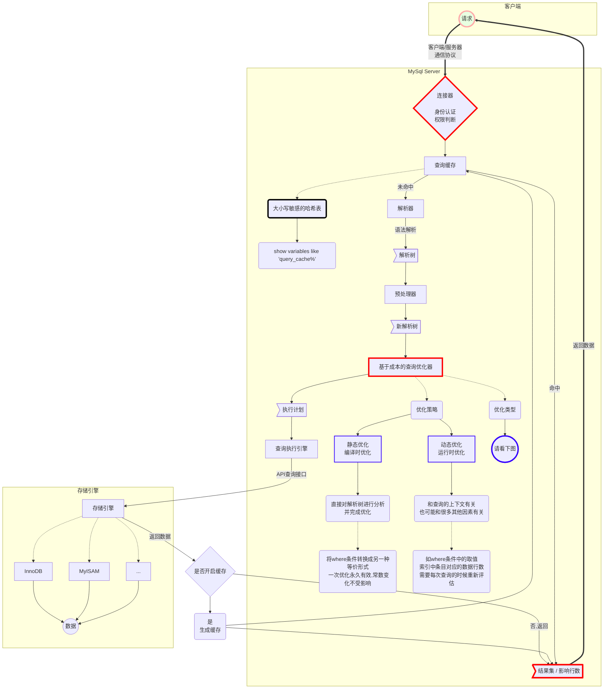
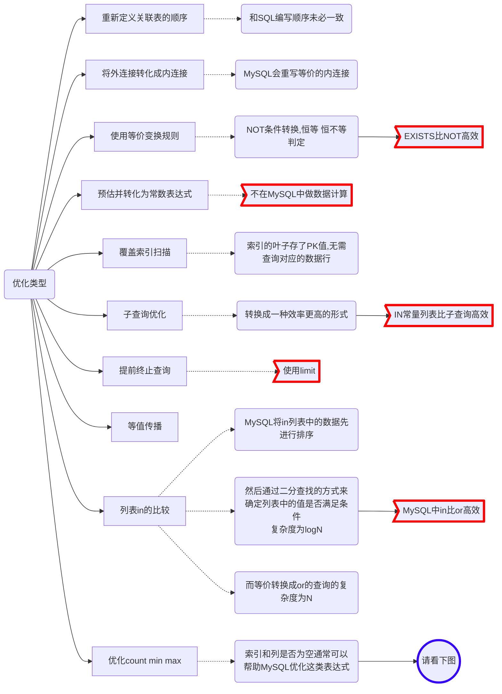
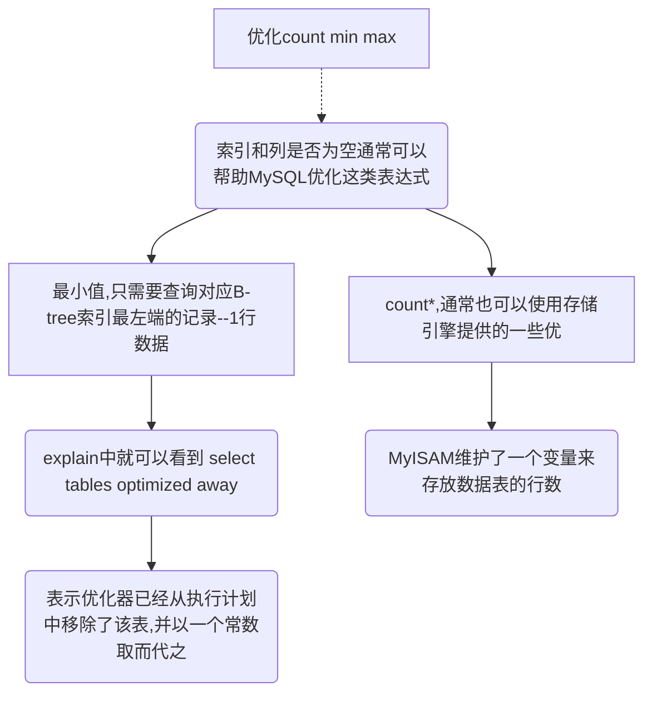

# query查询过程

## 总流程图

### 优化类型

### count()、max()、min() 优化


## Explain 查询分析器

### 概念

### 列-注释

range
触发条件：只有在使用主键、单个字段的辅助索引、多个字段的辅助索引的最后一个字段进行范围查询才是 range

## 缓存参数设置

| 参数 | 用途 | 备注  |
| ----- | ------ | ------- |
| query_cache_limit | MySQL能够缓存的最大结果 | 如果超出,则增加 Qcache_not_cached的值,并删除查询结果 |
| query_cache_min_res_unit  | 分配内存块时的最小单位大小  |  |
| query_cache_size | 缓存使用的总内存空间大小,单位是字节 | 必须是1024的整数倍，否则实际分配和配置值不同 |
| query_cache_type | 是否打开缓存 | OFF: 关闭 ON: 总是打开  |
| query_cache_wlock_invalidate | 如果某个数据表被锁住,是否仍然从缓存中返回数据 | 默认是OFF,表示仍然可以返回 |

## 联表

* 内连接分为3种：
  
    FROM a INNER JOIN b 
    FROM a JOIN b 
    FROM a b

* inner Join on 条件字段为 null 的数据**会过滤掉**


* 外连接分为2种：

    左外链接：FROM 主表 LEFT JOIN b JOIN 从表
    右外连接：FROM 从表 RIGHT JOIN b JOIN 主表

* left Join on 条件从表数据为 null 的数据**不会过滤**

 ## 子查询  

```tip
⼀般来说，能⽤ exists 的⼦查询，绝对都能⽤ in 代替，所以 exists ⽤的少。推荐使用 in

【大坑】not	in 的情况下，⼦查询中列的值为 NULL 的时候，外查询的结果为空。
```

⼦查询的执⾏优先于主查询执⾏，因为主查询的条件⽤到了⼦查询的结果。

| 名称      | 结果集              | 用于                               | 用法                                                                                                      |
| --------- | ------------------- | ---------------------------------- | --------------------------------------------------------------------------------------------------------- |
| 标量⼦查询 | ⼀⾏⼀列               | select后⾯ <br> where或having后⾯    | >、<、>=、<=、=、<>、!=、in、not in                                                                       |
| 列⼦查询   | ⼀列多⾏              | where或having后⾯                   | in、not in、any、some、all <br> a>some(10,20,30) 大于任意一个值 <br> a>min(10,20,30) <br> a>max(10,20,30) |
| ⾏⼦查询    | ⼀⾏多列              | where或having后⾯                   | in、not in、any、some、all <br> a>some(10,20,30) 大于任意一个值 <br> a>min(10,20,30) <br> a>max(10,20,30) |
| 表⼦查询   | 多⾏多列<br>一行多列 | from后⾯(必须起别名) <br> <br> exists(相关⼦查询)后⾯ | 各种 join <br> <br> 完整的查询语句，返回 1 或 0 |

⾏⼦查询（⼦查询结果集⼀⾏多列）
```sql
--  ⽅式1
SELECT *
FROM employees a
WHERE a.employee_id = (SELECT min(employee_id) FROM employees)
    AND a.salary = (SELECT max(salary) FROM employees);

--  ⽅式2
SELECT *
FROM employees a
WHERE (a.employee_id, a.salary) = 
    (SELECT min(employee_id), max(salary) FROM employees)

--  ⽅式3
SELECT *
FROM employees a
WHERE (a.employee_id, a.salary) in 
    (SELECT min(employee_id), max(salary) FROM employees);
```
