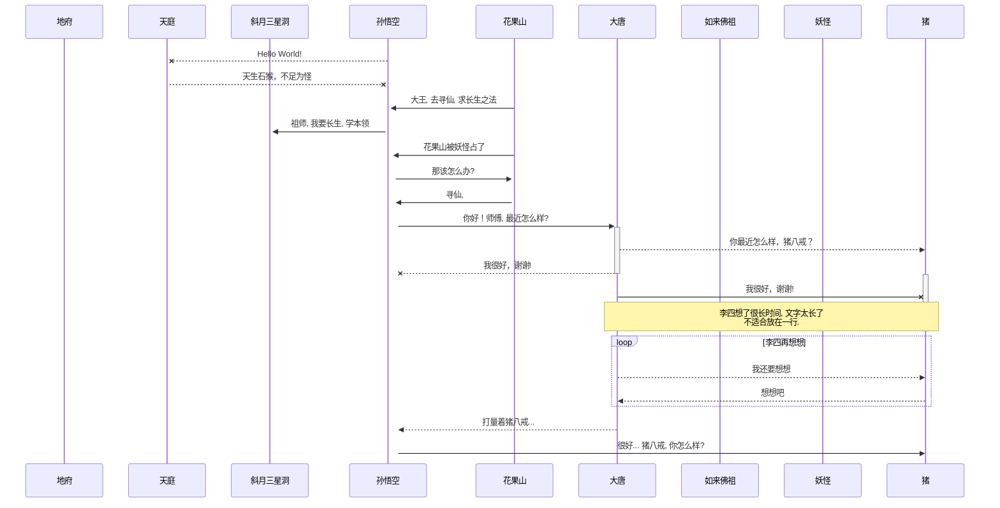

# 故事梗概

```mermaid
    sequenceDiagram

    participant 鬼 as  地府   
    participant 天 as 天庭
    participant 洞 as 斜月三星洞
    participant 孙 as 孙悟空
    participant 山 as 花果山
    participant 唐 as  大唐   
    participant 佛 as 如来佛祖
    participant 妖怪 as 妖怪
    

    孙 --x +天: Hello World!
    天 --x +孙: 天生石猴，不足为怪
    山 ->> +孙: 大王, 去寻仙, 求长生之法
    孙 ->> +洞: 祖师, 我要长生, 学本领
    山 ->> +孙: 花果山被妖怪占了
    孙 ->> +山: 那该怎么办?
    山 ->> +孙: 寻仙,

    孙 ->> +唐: 你好！师傅, 最近怎么样?
    唐-->> 猪: 你最近怎么样，猪八戒？
    唐--x -孙: 我很好，谢谢!
    activate 猪
    唐-x 猪: 我很好，谢谢!   
    Note over 唐,猪: 李四想了很长时间, 文字太长了<br/>不适合放在一行.
    deactivate 猪
    loop 李四再想想
    唐-->>猪: 我还要想想
    猪-->>唐: 想想吧
    end
    唐-->>孙: 打量着猪八戒...
    孙->>猪: 很好... 猪八戒, 你怎么样?
```