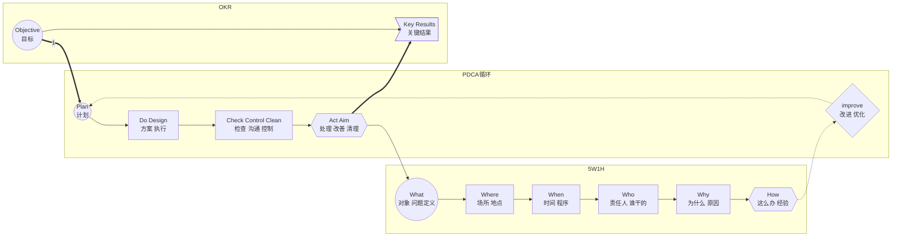

# OKR(目标和关键结果)

```danger
OKR的两个核心原则：在精不在多和全体公开、透明。
```

* WHY:企业越大，人员越多，发生内耗和浪费的可能性越大




## O(目标Objective)

| 时效 | 层次 | WHAT | WHO |
| ---- | ---- | ---- | ---- |
| 长期 | <b>使命</b> | 企业存在的意义 | BOSS |
| 5~10年 | <b>愿景</b> | 企业未来清晰可描述的画面<br>远景蓝图、价值观 | CEO |
| 3~5年 | <b>战略</b> | 让愿景落地的具体实施的方向<br>广泛的优先事项 | 总监 |
| 季度 | <b>目标-战术</b> | 实现局部、阶段目标的具体方法<br>近期的重点 | 经理 |
| 月/周 | <b>执行-关键结果</b> | 对战术分解具体的任务和工作<br>我们如何知道已经实现了目标 | 员工 |

* 目标思维：结构化目标设定
* 聚焦思维：最优先、最关键
* 协同思维：纵向分解、横向协同
* 敏捷思维：以客户为中心、快速迭代、持续跟进
* 成长思维：承诺型目标100%完成+挑战性目标

## KR(Key Results关键结果)

* 以结果为导向

## 企业文化

* 敏捷
* 教练文化
* 以客户为中心