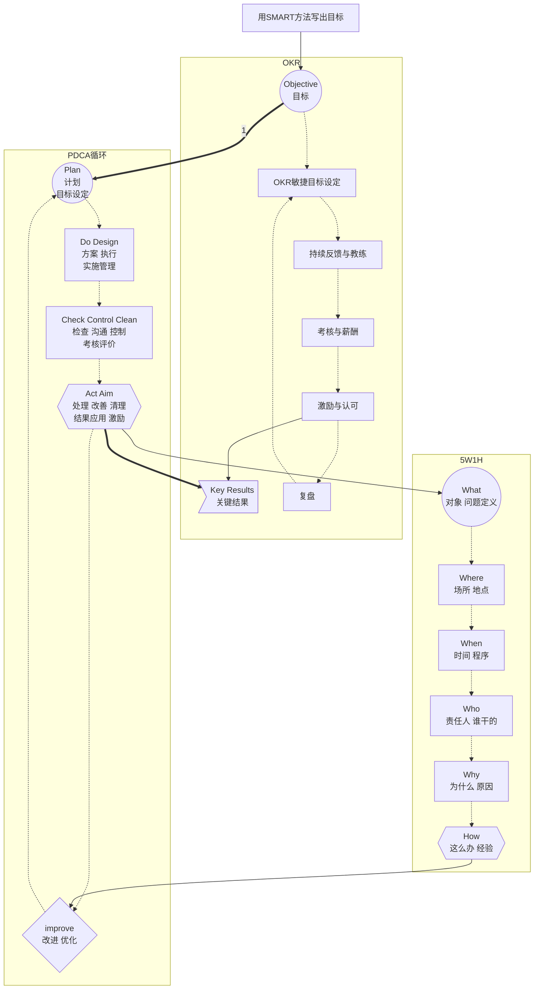
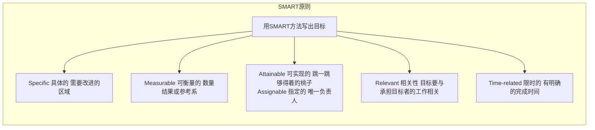
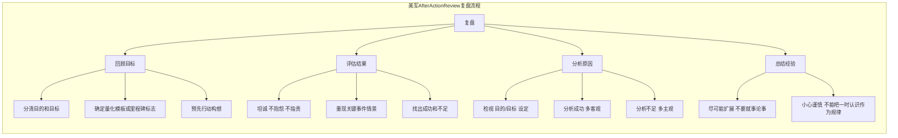

# OKR敏捷绩效管理

```danger
OKR的两个核心原则：在精不在多和全体公开、透明。
```









## WHAT

* OKR是一个设定目标的工具
* OKR是一个组织沟通的工具
* OKR是通过结果去衡量过程的方法
* OKR是一种能促进员工与团队协同工作的思维方式
* OKR是当前(VUCAs时代)的最佳实践


### VUCA时代

| VUAC |  | VS |  | VUCA Prime |
| ---- | ---- | ---- | ---- | ---- |
| Volatility | <b>动荡</b><br>变化的速度快，明天不可知 | <b>应</b> | <b>愿景</b><br>为创造更美好的未来注入了强大的动力 | Vision |
| Uncertainty | <b>无常</b><br>不确定性大，未来难预测 | <b>对</b> | <b>明白</b><br>唯有变化是不变的，拥抱变化 | Ubderstanding |
| Complexity | <b>复杂</b><br>影响因素多赢，管理关系复杂 | <b>方</b> | <b>明确</b><br>明确事物的本质和商业的基本规律 | Clarify |
| Ambiguity | <b>模糊</b><br>对事物缺乏清晰准确的认知 | <b>法</b> | <b>敏捷</b><br>迅速感知变化并可以有效地作出反应 | Agility |

* 敏捷
> 对需求不明、变化快的项目(如：IT),敏捷开发是最佳实践
> 
> 传统金字塔组织容易导致官僚主义，敏捷组织扁平高效、领导力体现为方向和赋能
> 
> “千禧一代”引领的时代习惯于在生活中收获即使反馈，可以说是敏捷时代的一个体现

### O(目标Objective)

| 时效 | 层次 | WHAT | WHO |
| ---- | ---- | ---- | ---- |
| 长期 | <b>使命</b> | 企业存在的意义 | BOSS |
| 5~10年 | <b>愿景</b> | 企业未来清晰可描述的画面<br>远景蓝图、价值观 | CEO |
| 3~5年 | <b>战略</b> | 让愿景落地的具体实施的方向<br>什么对总体成功最重要 | 总监 |
| 季度 | <b>目标-战术</b> | 实现局部、阶段目标的具体方法<br>近期的重点<br>承诺性目标、挑战性目标 | 经理/员工 |
| 月/周 | <b>执行-关键结果</b> | 对战术分解具体的任务和工作<br>我们如何知道已经实现了目标 | 员工 |

* 目标思维：结构化目标设定
* 聚焦思维：最优先、最关键
* 协同思维：纵向分解、横向协同
* 敏捷思维：以客户为中心、快速迭代、持续跟进
* 成长思维：承诺型目标100%完成+挑战性目标

### KR(Key Results关键结果)

* 以结果为导向

## WHY

```danger
企业越大，人员越多，发生内耗和浪费的可能性越大
```

### 绩效

```tip
如何衡量组织：BSC 是围绕企业的战略目标，从 财务、顾客、内部流程、学习与成长 这四个方面对企业进行全面的测评体系

如何考核个人(外在激励、压力)：KPI 是对公司战略目标做分解，能有效反映关机业绩驱动因素变化的衡量参数

如何聚焦目标(自我管理、内驱力)：OKR 是一套明确和跟踪目标及其完成情况的管理工具和方法
```

* 绩效管理的目标
  > 战略目标落地(要干什么、怎么干)
  > 
  > 为管理提供数据支撑(干得好有什么标准？有奖惩吗)
  > 
  > 提高个体和团队能力(告诉大家怎样干得更好)
* 绩效是组织的立命之本
* 传统绩效适应稳定的工业生产环境，强制分布活力曲线2-7-1扼杀创新，加重内耗
* 当企业的管理开始迷信于某种单一化指标，也就意味着组织陷于僵化

### OKR

* OKR敏捷绩效管理模型
  > OKR敏捷目标设定(SMART原则)
  > 
  > 持续反馈与教练(及时反馈、把控) —— 反馈能够促进目标更好地实现
  > 
  > 考核与薪酬(参考，不直接画等号) —— OKR执行结果不做业绩考核
  > 
  > 激励与认可(提升主动性、积极性)


* OKR的价值

  > 提升公司战略执行的聚焦度
  > 
  > 培育团队成员的目标和结果意识
  > 
  > 加强跨部门和层级的沟通，让企业更加扁平
  > 
  > 让企业更适应快速的变化
  > 
  > 识别出搞绩效员工

## HOW

```danger
【明确战略】是设定OKR的前提，OKR不仅是一种【衡量目标进展】的方法，还是一种【沟通工具】
```
* 方向——回顾使命，澄清愿景
* 制定目标——根据上级OKR制定承诺性目标(100%完成)
* 制定目标——从使命、角色出发制定挑战性目标(内驱、创新)，对组织未来有重要意义
* 思考策略——根据目标，分析和思考如何去完成目标，寻找策略、方法、措施
* 定义任务结果——这个结果对目标有没有作用，这个结果是否能确保任务完成
* 确定结果——定义量化方法、参照
* 撰写OKR——写下目标，公开透明

### 如何撰写OKR

* 如何撰写目标
  > 目标要能支撑战略，寻找目标的意义
  > 
  > 少而精(每个季度1页A4纸；2~5个O,每个O有2~4个KR)，寻找问题的根源
  > 
  > 适当野心，不要设定一些平常的目标——没有成长
  > 
  > 有时限(双周/月/6周/季度/年)
  > 
  > 由下而上(主动参与、内驱力)
  > 
  > 定性和定量，表达清晰，避免模棱两可

* 如何撰写关键结果
  > 基于目标，抓住少量关键结果
  > 
  > 可量化，能够衡量中期进度
  > 
  > 要有挑战性，要有明确的负责人

* OKR打分原则：简单易行，[0, 1],合理分值是[0.6, 0.7]

### OKR日常管理

* 日站会：昨天做了什么来帮助团队，今天要做什么，遇到的问题和需要协调的资源
* 周例会：目标进度确认，风险预估，得失总结，下周计划
* 月例会：进度确认，根据需要调整OKR、优先级
* 季度复盘会：复盘上一季度的OKR，确定当季的OKR，1~2天
* 半年/年度复盘与展望会：评价结果，未来规划，提升与改善的具体措施

### OKR实施要点

* 要有具体的执行方案
* 负责人决定原则：谁最有利于目标实现就让谁负责，其次 谁提出的谁负责
* 定期检查，双向沟通，及时调整
* 执行结果不做业绩考核。分数的唯一用途是让员工诚实、准确地评判自身表现，以保证执行的过程不会出现畸形结果
* 公开透明
* 保持流程简洁，找到合适的工具
* 让每位员工觉得自己很重要

### 沟通与面谈

## 企业文化

* 敏捷
* 教练文化
* 以客户为中心

