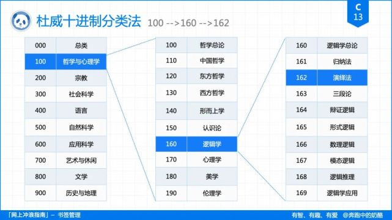
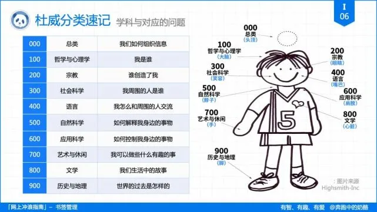

# 分类

```tip
1、唯一分类维度 | 【MECE原则】：相互独立、完全穷尽

2、杜威数字编码 | 数字位数表示层级(建议三层)，每一类不超过10条

3、规范命名规则 | 名称由三部分构成：数字编号(杜威)，四大分类，具体名称

4、GTD信息处理流程 | 收集——>整理——>组织——>计划——>执行——>复盘
```


## 杜威十进制图书分类法

```tip
分类是个严肃的哲学问题；

分类是我们认识世界，认识事物的方式；

分类，在于对本质的把握。

                              ——杜威
```



```tip
全世界图书馆都在用的编码系统：杜威十进制数字编码

粗放分类: 不断更迭，逐步完善。

自己定义文件命名的原则：清晰、简洁、一致性。


【划定边界】不用标签代替（性质维度、搜索锚点）分类
```



* 应用到我们的生活中，分类可以按性质分类：

> 工作

> 学习

> 兴趣

> 生活相关


## 中国图书馆分类法

```tip
哲学: 哲学、宗教、政治
社会科学: 语言、文化、经济、艺术、教育
自然科学: 数学、农学、工学、医学、技术
综合学科：跨学科
```

### 扩充分类

* 收件箱：新资料，待分类
* 工作：技能、文档、总结、学习资源 
* 生活：纪念、清单、习惯、极简主义
* 兴趣/爱好：
* 归档/废弃：总结干活，清理库存

## 实践

|-InBox(收件箱，待分类)
|-public(家庭共用资源汇总，**中国图书馆分类法** 分4个类目，类目下使用**杜威十进制图书分类法**)
|-家庭成员名(每个人的私有文件，单独一个目录，按扩充分类设一级目录，二级目录开始使用**杜威十进制图书分类法**)
|-废弃(废弃资源，可供其他成员回收)