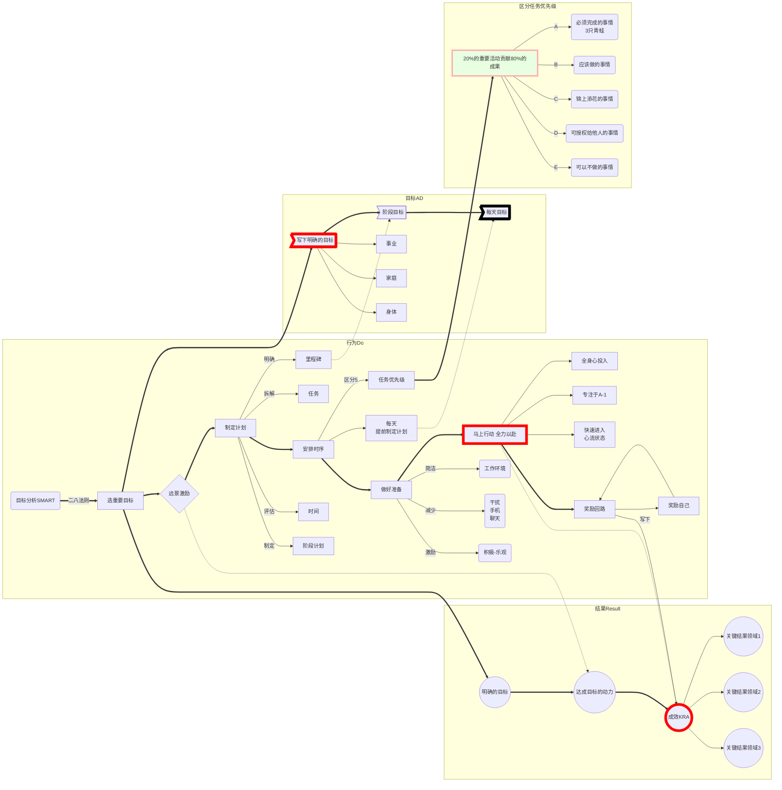

# 吃掉那只青蛙


```tip
无论身处何境，倾你所有，尽你所能。

如果你必须吃掉两只青蛙，那么要先吃那只长得更丑陋的。

如果你要完全吃掉一致活青蛙，却只是一直坐在那里盯着它看，看得再久也无济于事。
```
【自律养成奖励回路】

    明确目标：写下你想要完成的事情清单，选出最重要的一件
    远景激励：憧憬想象一整年已经过去，你已经实现了这个目标，将对自己生活产生怎样的影响
    制定计划：任务拆解，制定阶段目标里程碑，时间评估
    安排时序：区分优先级，安排顺序，每天提前制定计划
    做好准备：简洁的工作环境，减少干扰，给自己积极的激励
    马上行动：快速进入心流状态，专注于A-1任务
    奖励回路：写下自己的成效，给自己奖励。让正向回路形成习惯

<hr />



## 1、明确目标

    把目标明确(SMART)下来写在纸上，设定最后期限。
    想象自己如期实现了目标，这将对自己的生活产生怎样的影响。
    为了实现这个目标，需要拆解目标，制定计划(核算时间分配是否合理)。
    全身心投入执行。

    最糟糕的利用时间的情形之一，是把根本不需要做的事情做得很完美。

## 2、每天提前制定计划

提升回报率

## 3、将二八(帕累托)法则用于你的所有任务

    20%的重要活动(青蛙)贡献80%的成果
    把你的工作事项列成清单，每天只能做三件事，选出3项。
    你对公司90%的贡献都来自这3项最重要的工作。

    抵制诱惑，不被小事(蝌蚪)所诱惑

    重要任务优先3件以内

## 4、考虑效果

    用长期时间观念的思维优化你做出的短期决定
    未来的意义常常会左右目前的行动

    强迫效率法则：时间有限，任何人都无法做完所有的事情——效率，性价比

    最后期限只是借口，效率并没有提高

    有关生产力最大化的3个问题：
        1、我的最高价值的工作是什么——我必须吃的那只最大的青蛙是什么？
        2、我只有把哪件事情做好了才会产生非凡的影响？
        3、【核心】此时此刻，对我来说最有价值的事情是什么——此时我最大的青蛙是什么？

## 5、学会说不

巴菲特：成功的秘密非常简单，我会对当下不重要的事情说不

把花费时间长的活动(性价比低)设定为次优先级

当你不再去做那些低优先级的工作时，你的时间和生活才能完全掌握在自己手中。


## 6、区分优先级——ABCDE法

区分优先级 ABCDE，如果有A类任务没有完成，决不要先去做B类任务

    A:【青蛙】重要，必须完成的事情;3件以内，A-1 A-2 A-3
    B:【大蝌蚪】应该做的事情；如果不做，后果并不十分严重
    C:【锦上添花】做了大家都愉快，但是不做也没有人为此感到不悦
    D:【小蝌蚪】可以授权给他人做的事情
    E:【无关紧要】可以不做的事情

立即行动 吃掉A-1
## 7、聚焦关键结果领域(OKR)

【重要的问题】什么技能是 如过我掌握了并做到极致，就能给我的事业带来最积极的影响？

我凭什么能拿到工资——为公司完成一些具体工作(质量*数量)——战胜拖延并且更快地做更多事情

每一项工作一般都可以分解为5~7个关键结果领域(KRA——key result area)
你最弱的关键结果领域会影响你发挥其他技能的水平
薄弱环节导致工作拖延

管理工作的7大要素：计划、组织、配备人员、授权、监督、检查、报告

## 8、遵守3个定律

一时专注一事，全身心投入

快速列出清单，马上行动

平衡不是可选择的，只能一直在行动中努力寻找平衡。

## 9、做好重复准备再行动

提前做适当的准备，能够避免表现不佳

稳扎稳打，不打无准备之仗

客服拖延、提高工作效率最好的方法之一，就是在开始工作之前最好充分准备。

    创造舒适的工作空间——简洁，专注

## 10、每次到达下一个里程碑

跳一跳，摘桃子
明确目标——明确成果

## 11、升级核心技能

升级核心技能 是提高个人生产力的重要定律之一

你越擅长吃某个特定类型的“青蛙”，你就越容易投入并完成此项工作。

在任何领域想要获得成功的最低要求是：要不间断地学习。

学而实习之

## 12、找到关键的限制因素

限制因素只有20%来自外部
从自身找原因(80%)，写下改进措施，用行动改变自己

## 13、自我设定压力目标

    有挑战性的目标(追求卓越)
    最后期限(假设只剩下最后一天，次日必须去另一个城市)，迭代二八原则——提效

## 14、激励自己将理想转化成行动

勇于面对现实，承担责任

    【控制你跟心灵的对话】
    为了有最佳的表现，你必须做自己的啦啦队长，不断激励自己
    
    你对自己的评价、自尊、自爱的程度，很大程度上决定你工作时自我激励的程度，及能否坚持不懈地工作。
    不断的告诉自己：我能做到！我能做到！
    如果有人问你此刻感觉如何，一定要告诉他们：“我感觉棒极了！”

    二八法则：永远不要把你的困难告诉别人，
    因为80%的人对你的困难不感兴趣，
    而另外的20%的人也许会对你的遭遇感到幸灾乐祸。

    【建立积极的态度】
    在任何情况下都会去看事情好的一面
    从挫折和苦难中总结经验，吸取教训。
    极力找出问题的解决办法
    不断地思考和谈论他们的目标

## 15、技术是一个可怕的掌控者

【技术仅仅是工具而已】

    找回属于自己的时间，不为外物所累
    删除80%的订阅
    每周给自己一整天时间，不开电脑，不用手机。

## 16、技术是一名出色的仆人

利用技术掌控你的时间——清单、Excel


## 17、高度的专注力

单核工作法

生命完全是一场专注力的修行，你专注于哪里，你的生命就在哪里。

把生产力提升两倍的技巧：每天提前制定以整体的计划，选出最重要的任务，完成后再做其他的任务。

番茄工作法+休息(奖励回路)

## 18、奶酪和香肠工作法

香肠工作法：任务分解，一次吃一片，通过多次完成工作的喜悦来激励自己完成整个任务。
奶酪工作法：设定一小段时间完成一个小任务，然后去完成下一个任务(每次挖个洞)
## 19、创造整块的时间

整块的时间做最重要的事情

## 20、保持紧迫感

马上行动，进入最佳状态(心流 state of flow)，激发高效能
拥有心理的方法之一就是培养一种紧迫感

## 21、单独处理每一项任务

一旦开始 全力以赴
成功的第一要素：必须全身心地做一件事情，绝不能有任何懈怠。


