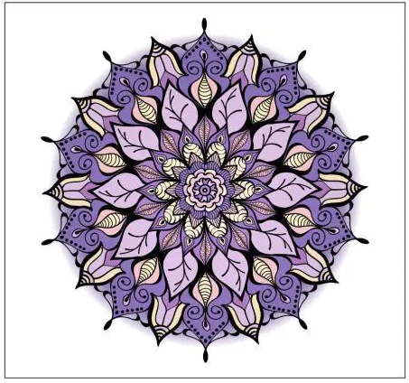
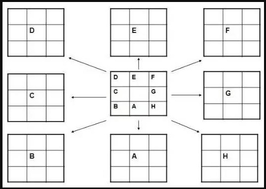
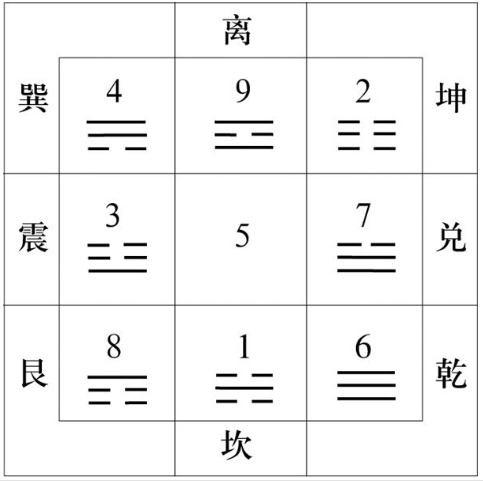

# 曼陀罗思考法

## 螺旋型

| 4  | 5 | 6 |
| ---- | ---- |---- |
| 3 | 中 | 7 |
| 2 | 1 | 8 |

## 十字模型
（5W1H）：What、Why、Who、Where、When、How

|    | What  |  |
| ---- | ---- |---- |
| Where | Who |When |
|  | Why | |

## 十字模型+辅助

|  What-ext  | What  | When-ext |
| ---- | ---- |---- |
| Where | Who |When |
| Where-ext | Why | Why-ext|

## 放射型

## 九宫八卦型

## 双循环

| 6  | 3 | 7 |
| ---- | ---- |---- |
| 2 | 中 | 4 |
| 5 | 1 | 8 |

## 四对因素

| 3正面 | 1正面 | 4正面 |
| ---- | ---- |---- |
| 2正面 | 问题 | 2反面 |
| 4反面 | 1反面 | 3反面 |

## 知识体系总目录

|  ④科学(通识、数理)  |  ⑨玩(娱乐、杂、耍)  |②生存(IT、技能)  |
| ------- | -------- |--------  |
| ③身体(运动、养生)  | <b>学而实习之<b/> | ⑦心理(情商、调节)   |
| ⑧养育(健康、习惯) | ①道(法、律、原则) |⑥人文(人、文、俗)|

### 知识体系二级目录

| 曼 | 陀 | 罗 | * | 九 | 宫 | 格 | * | 结 | 构 | 化 |
| ------- | ------- | ------- | ------- | ------- | ------- | ------- | ------- | ------- | ------- | ------- |
| ④通识 | ⑨方法 | ②数学 | *  | ④武术 | ⑨图片 | ②音乐 | * | ④PHP | ⑨优化 | ②git |
| ③生物 |【科学】| ⑦化学 | * | ③漫画 | 【玩】 | ⑦剪辑 | * | ③NoSQL | 【生存】 | ⑦MQ |
| ⑧物理 | ①精神 | ⑥手工 | * | ⑧电子书 | ①视频 | ⑥魔术 | * | ⑧测试 | ①架构 | ⑥Go |
| * | * | * | * | * | * | * | * | * | * | * |
| ④保养 | ⑨养生 | ②呼吸 | * | ④科学 | ⑨玩 | ②生存  | * | ④幸福 | ⑨逆商 | ②大众 |
| ③作息 |【身体】| ⑦节律 | * | ③身体 | 【本】 | ⑦心理 | * |③儿童 |【心理】|⑦犯罪|
| ⑧冥想 | ①运动 | ⑥检修 | * | ⑧养育 | ①道 | ⑥人文 | * | ⑧自我 | ①情商 | ⑥共情 |
| * | * | * | * | * | * | * | * | * | * | * |
| ④玩具 | ⑨习惯养成 | ②饮食 | * | ④简法 | ⑨玩法 | ②实践 | * | ④居家 | ⑨哲学 | ②文学 |
| ③活动 |【养育】| ⑦睡眠 | * | ③分析法 | 【道】 | ⑦复盘法| * | ⑧手艺 | 【人文】 | ⑦享受 |
| ⑧起居 | ①备孕 | ⑥学习 | * | ⑧学习法 | ①工作法 | ⑥加法 | * | ⑧艺术 | ①人性 | ⑥旅行 |