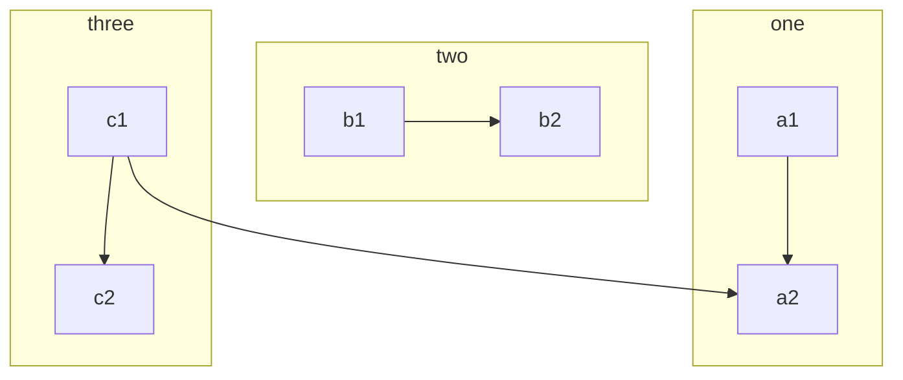
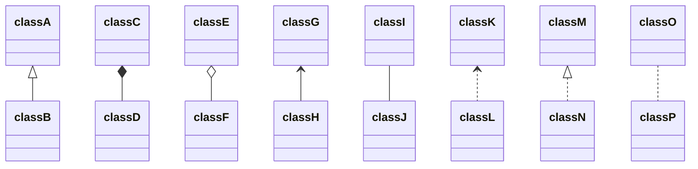
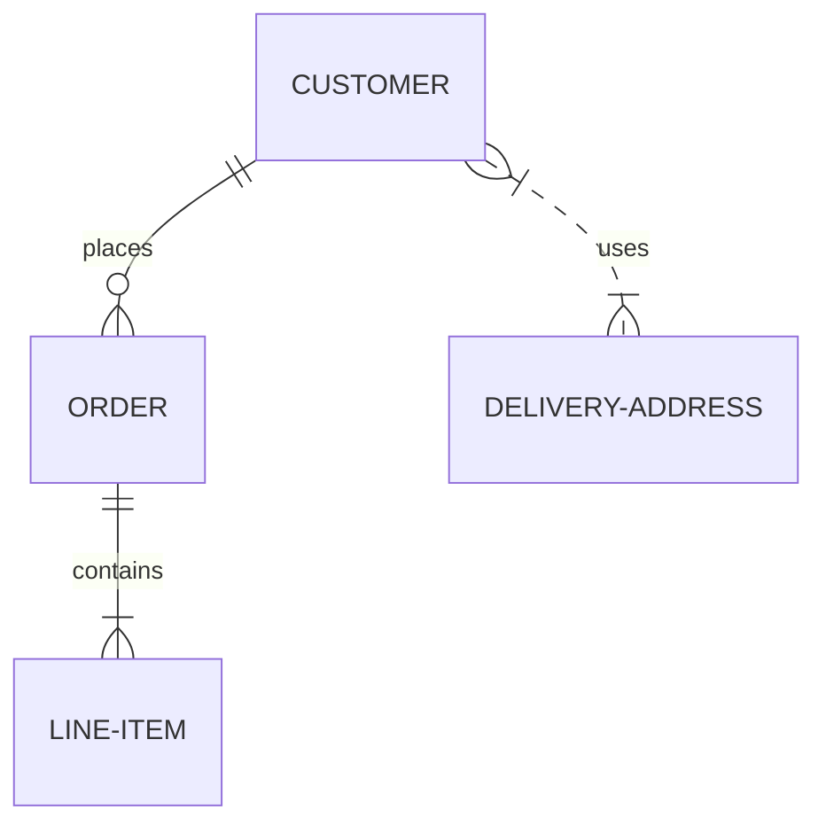
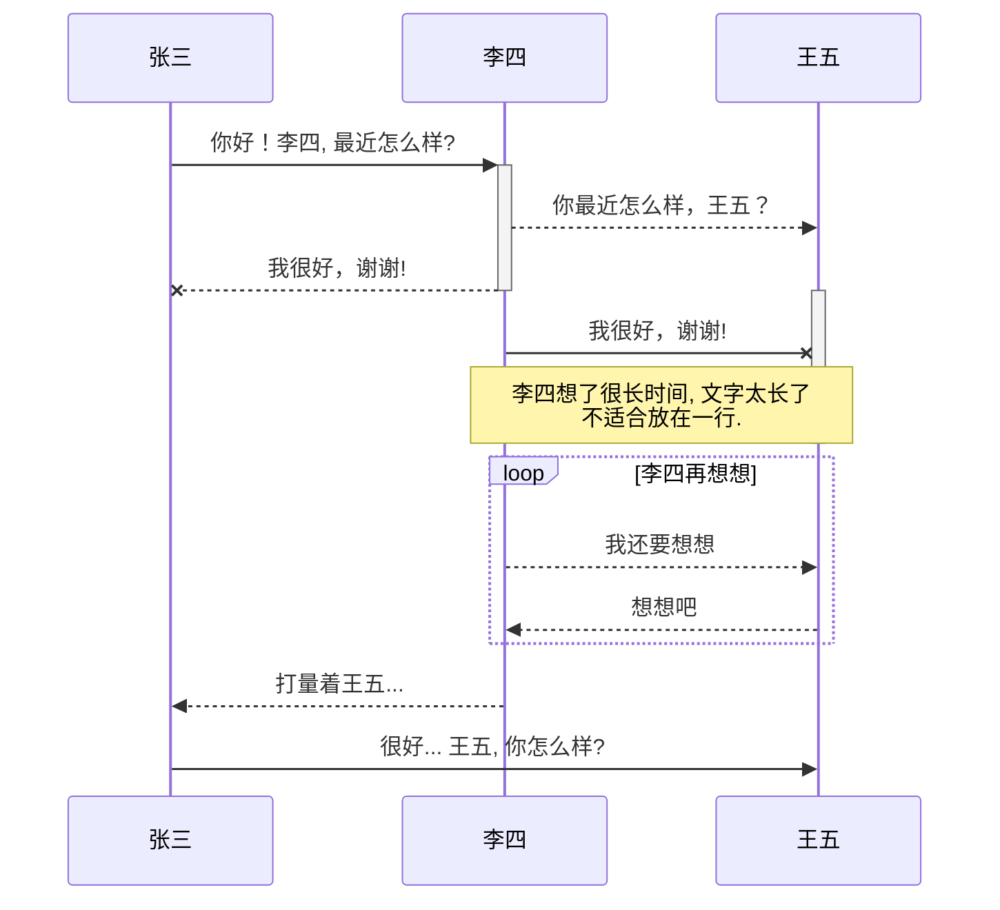
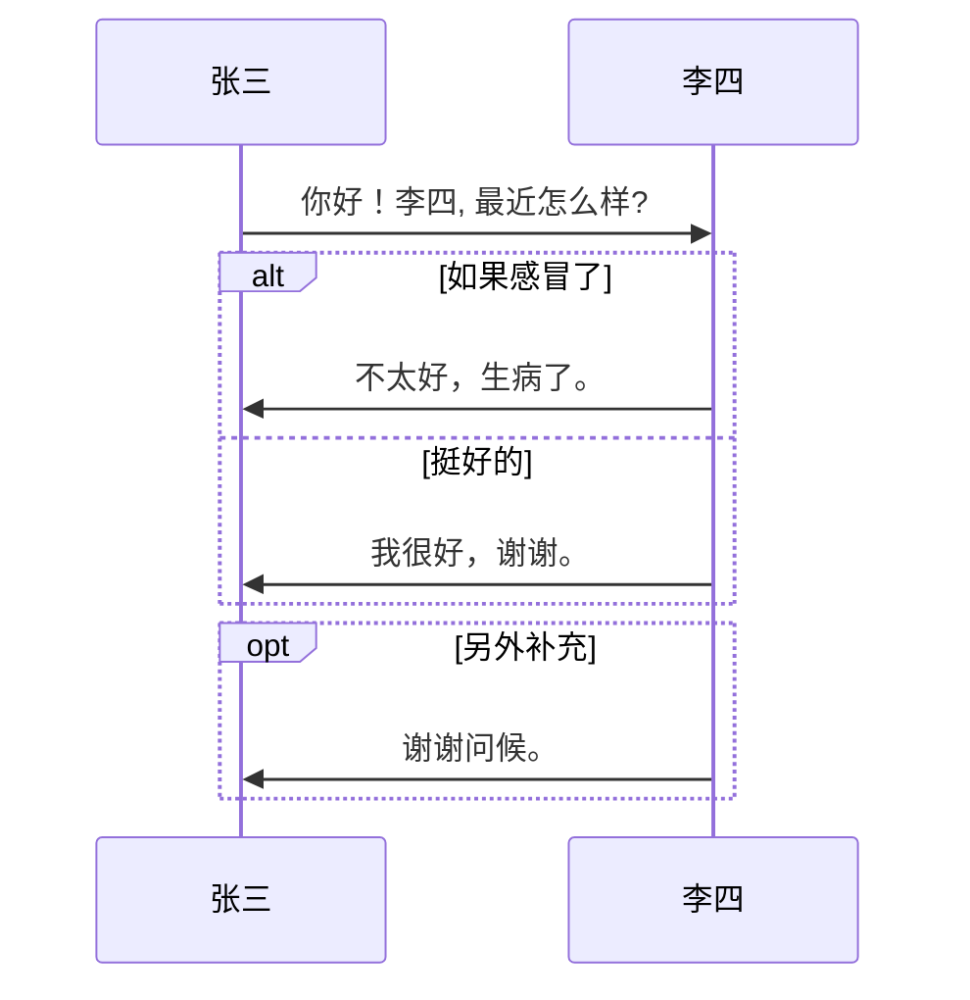

# 结构图

[markdown 中流程图详解](https://blog.csdn.net/suoxd123/article/details/84992282)

[文档](https://www.wenjiangs.com/doc/markdown-markdownflowchart)

[web216安全色](http://www.h-ui.net/websafecolors.shtml)

* 默认节点： A
* 矩形节点： B[矩形]
* 圆角矩形节点： C(圆角矩形)
* 圆形节点： D((圆形))
* 非对称节点： E>非对称]
* 菱形节点： F{菱形}

* 开始（椭圆形）：start
* 结束（椭圆形）：end
* 操作（矩形）：operation
* 多输出操作（矩形）：parallel
* 条件判断（菱形）：condition
* 输入输出（平行四边形）：inputoutput
* 预处理/子程序（圣旨形）：subroutine

## 文本


## 跨部门流程图


## 流程图


## 类图


## E-R图


## 流程图

```mermaid
	graph TB
	A[Apple]-->B{Boy}
	A---C(Cat)
	B.->D((Dog))
	C==喵==>D
	style A fill:#2ff,fill-opacity:0.1,stroke:#faa,stroke-width:4px
	style D stroke:#000,stroke-width:8px;
```


## 时序图




## 消息流


