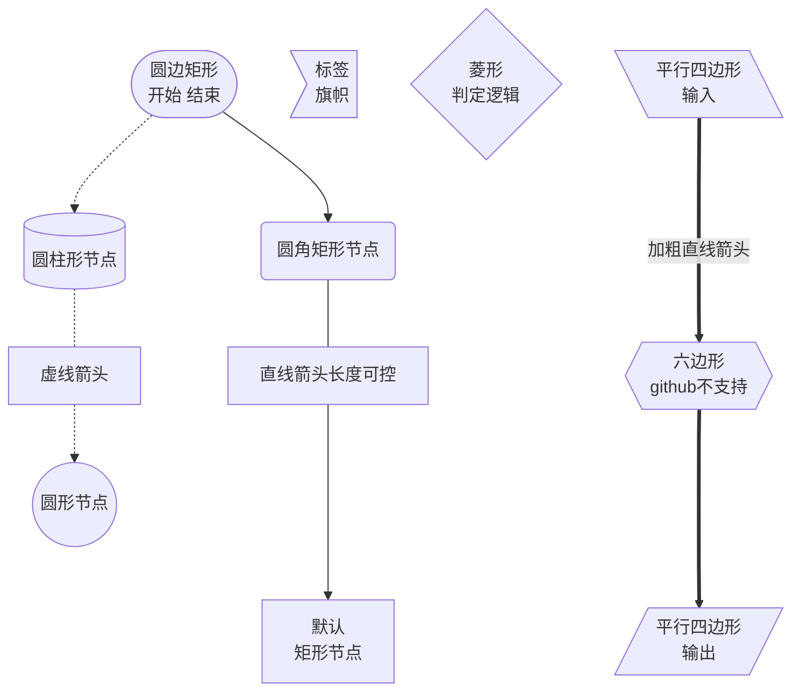
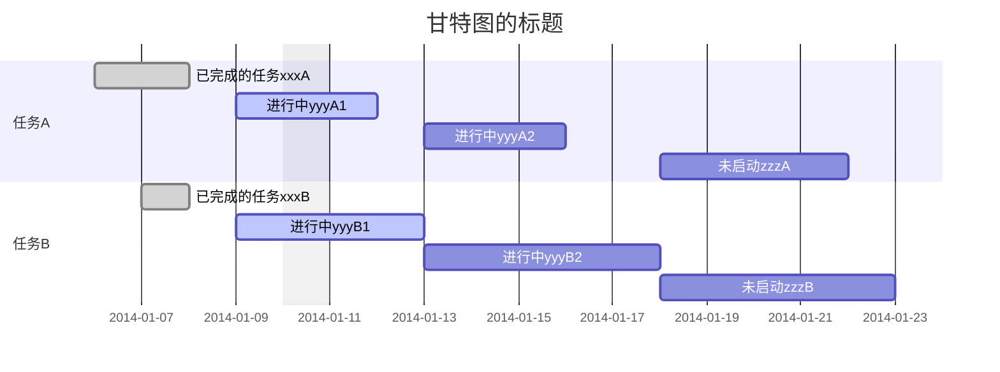

# 结构图

[markdown 中流程图详解](https://blog.csdn.net/suoxd123/article/details/84992282)

[MarkDown绘图mermaid流程graph](https://www.jianshu.com/p/598b121bdbef)

[文档](https://www.wenjiangs.com/doc/markdown-markdownflowchart)

[web216安全色](http://www.h-ui.net/websafecolors.shtml)


## 文本


## 跨部门流程图


## 流程图


## 符号

符号内部不能出现 **·**、**：**、**【】**、**{}**、**<>**、**[]**



## 类图


## E-R图


## 流程图

```mermaid
	graph TB
	A[Apple]-->B{Boy}
	A---C(Cat)
	B.->D((Dog))
	C==喵==>D
	style A fill:#2ff,fill-opacity:0.1,stroke:#faa,stroke-width:4px
	style D stroke:#000,stroke-width:8px;
```


## 时序图


## 消息流


## 甘特图

