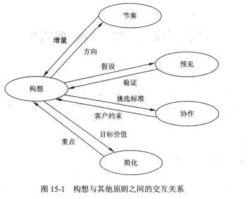

# 《架构宝典》笔记

[知乎笔记](https://zhuanlan.zhihu.com/p/512701223)

## 第1篇 架构方法论

## 第2篇 面向架构的架构(微服务)

## 第3篇 面向业务的架构

## 第4篇 面向性能的架构

## 系统架构文档化

* 逻辑视图 —— 元素、关系、E-R图、对象模型
* 过程视图 —— 进程、并发、同步
* 物理视图 —— 分布式、部署，可用性、吞吐量、可伸缩性
* 开发视图 —— 输入、输出、性能、质量，静态结构
* 场景    —— 架构的描述，即所做的各种决定

### VRAPS组织管理原则

* 构想原则：说明了如何向架构的受益人描述一幅一致的、有约束力和灵活的未来图景。
* 节奏原则：刻画了一种在整个组织范围内的协调程度，即定期地根据可预测的速度、内容和质量对制品生产进行检査与规划。
* 预见原则：要在预测未来与检査并适应现状之间做出平衡。
* 协作原则：解决了如何识别对架构成功关键的团体，以及如何确保这些合作伙伴的有效支持。
* 简化原则：要求理解组织的结构，了解架构最小的基本特征并最小化架构。

* 各个原则之间不是相互孤立的，图15-1解释了构想原则如何与其他原则交互。

