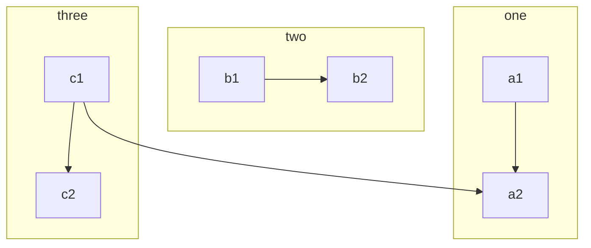
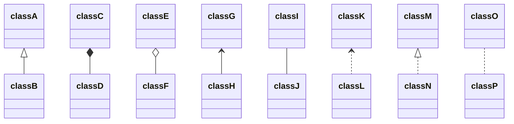
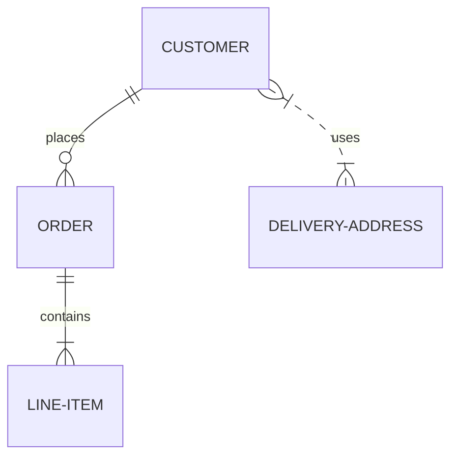

# 结构图

## 文本
    ```mermaid
    graph TB
        c1-->a2
        subgraph one
        a1-->a2
        end
        subgraph two
        b1-->b2
        end
        subgraph three
        c1-->c2
        end
    ```
## 跨部门流程图


## 流程图


## 类图


## E-R图

